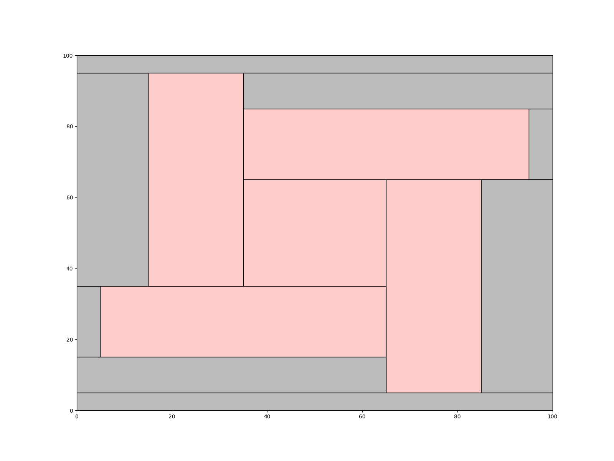
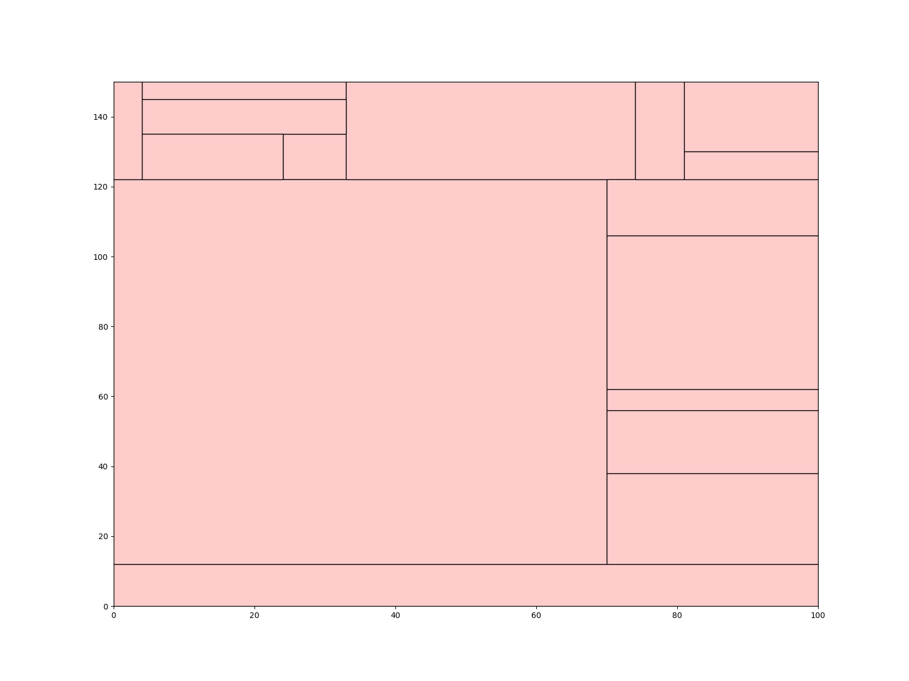
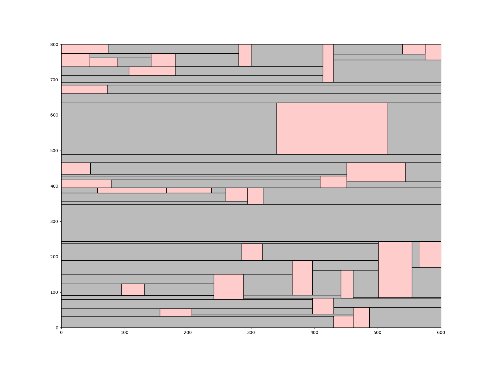
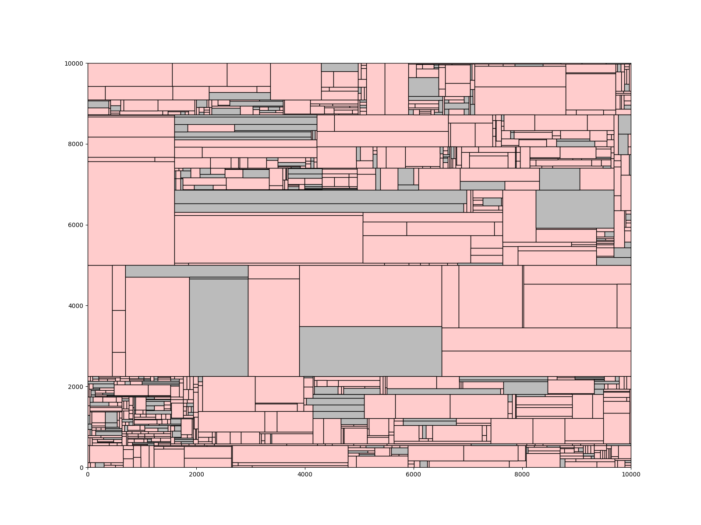
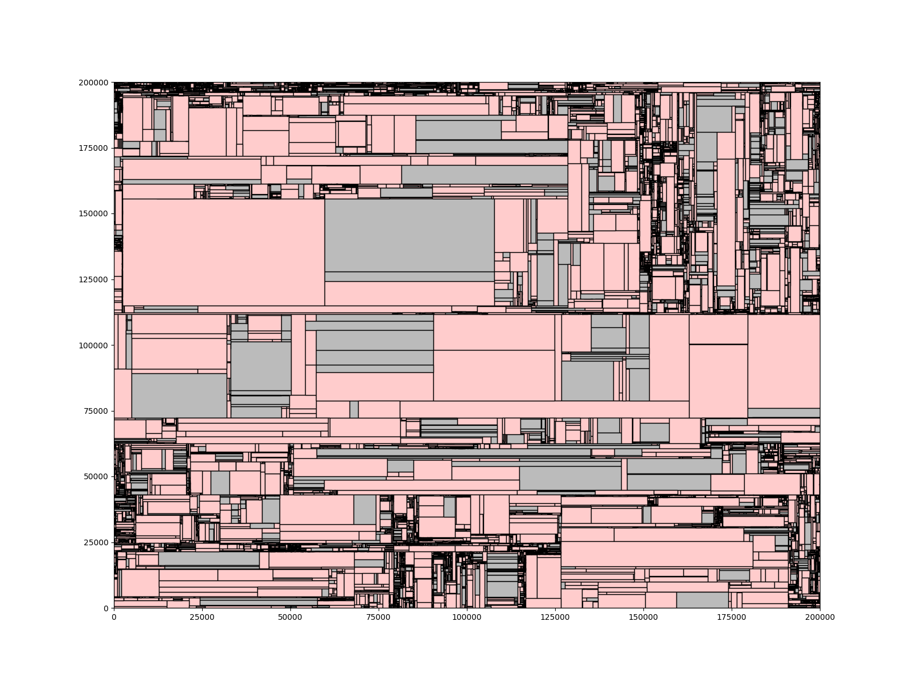
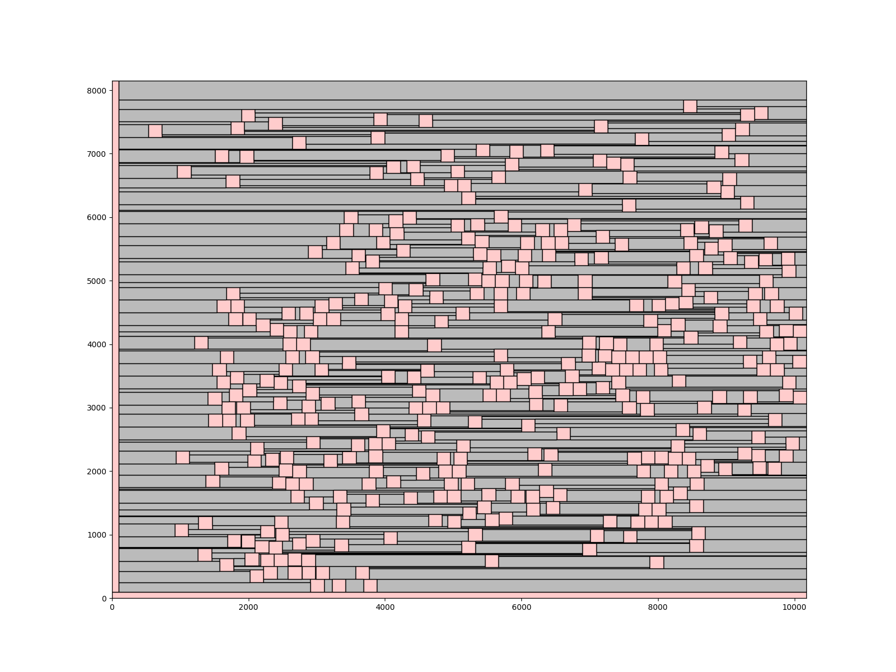
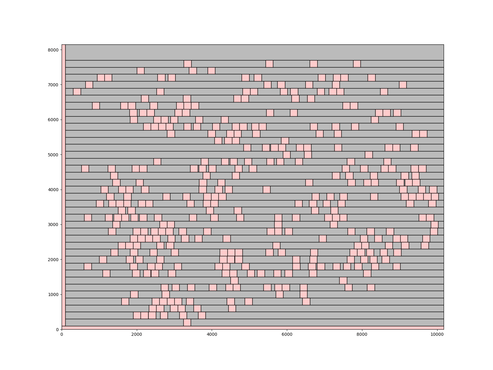

# Lab1 Corner Stitching
This lab focuses on the implementation of corner stitching and its underlying data structures to support basic layout representation. The input file provides information about block tiles, and as new block tiles are added, corresponding space tiles must be generated and maintained accordingly. 
  
For more details, refer to: [Lab1.pdf](Lab1.pdf) & [Lab1 Supplementary.pdf](https://github.com/TzuHsiang417/Physical-Design-Automation/blob/main/Corner%20Stitching/Lab1%20Supplementary.pdf)


## Compilation
Run the following command to compile the project:
```sh
make
```

## Clean
The following command removes all files generated during the compilation process:
```sh
make clean
```

## How to excecute
Run the program: 
```sh
./Lab1 [input_file] [output_file]
```
This lab produces two types of output files. The first is the output format file named `[output_file]`, which contains the placement results in a structured format. The second is a drawing format file named `drawing_[output_file]`, which is used for visualizing the placement results.

## Drawing
```sh
python3 draw_block_layout.py drawing_[output_file] [PICTURE_NAME]
```

## Results
| Case0                      | Case1                      |
|:--------------------------:|:--------------------------:|
| | |

| Case2                      | Case3                      |
|:--------------------------:|:--------------------------:|
| | |

| Case4                      | Case5                      |
|:--------------------------:|:--------------------------:|
| | |

| Case6                      | Case7                      |
|:--------------------------:|:--------------------------:|
| | |
