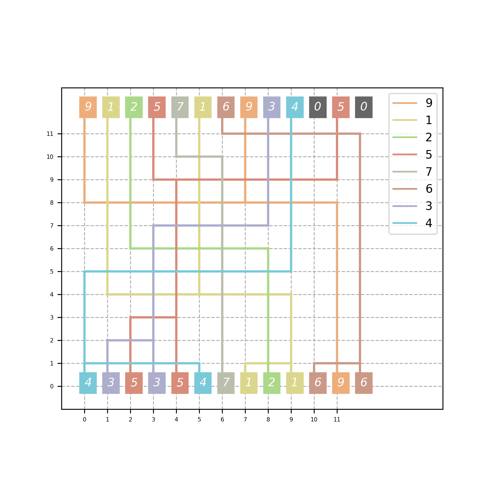
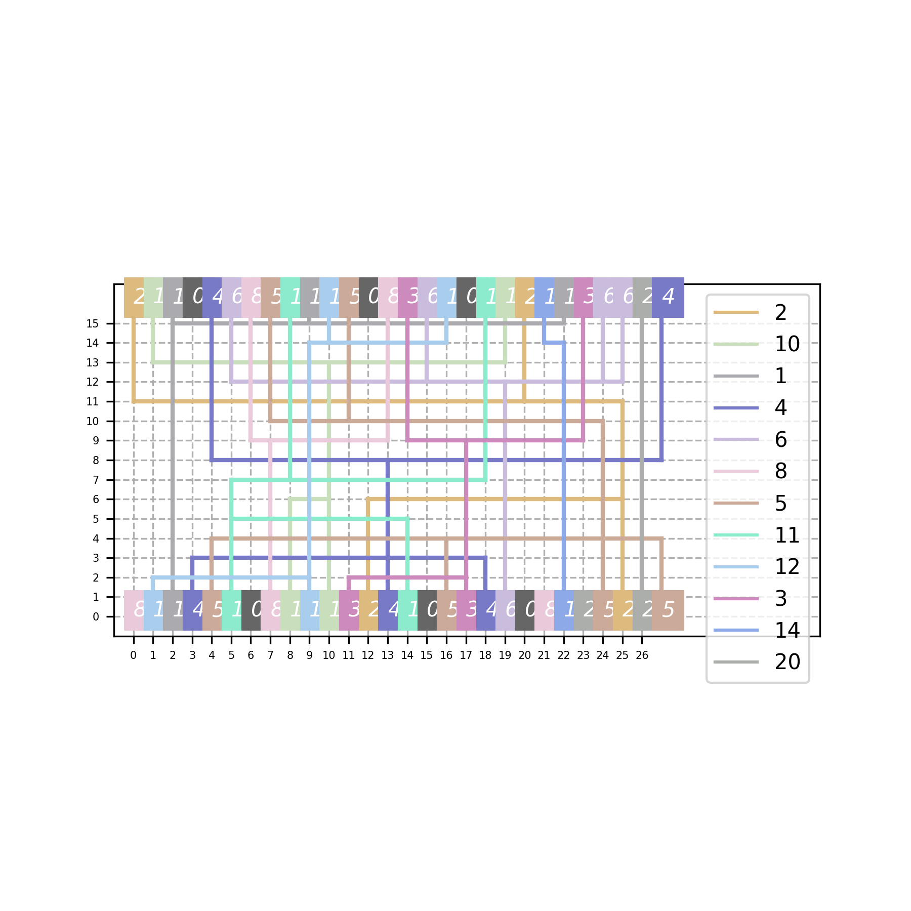
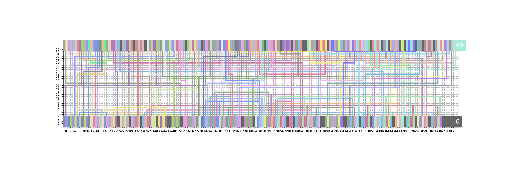

# Lab4 Detailed Routing
This lab focuses on the implementation of a detailed router to solve the channel routing problem, a fundamental task in physical design. Given the predefined horizontal vias information, the objective is to establish legal routing paths for each net within a constrained routing region, while avoiding overlaps.
  
For more details, refer to: [Lab4.pdf](Lab4.pdf)

## Compilation
Run the following command to compile the project:
```sh
make
```

## Clean
The following command removes all files generated during the compilation process:
```sh
make clean
```

## How to excecute
Run the program: 
```sh
./Lab4 [input.txt] [output] 
```

## Checker
```sh
./verifier [input.txt] [output]
```

## Drawing
```sh
python3 channel_routing_draw.py [INPUT] [OUTPUT] [PICTURE_NAME]
```

## Results
| Case1                                  | Case2                                  |
|:--------------------------------------:|:--------------------------------------:|
|             |             |

| Deutsch Difficult                      |
|:--------------------------------------:|
| |
