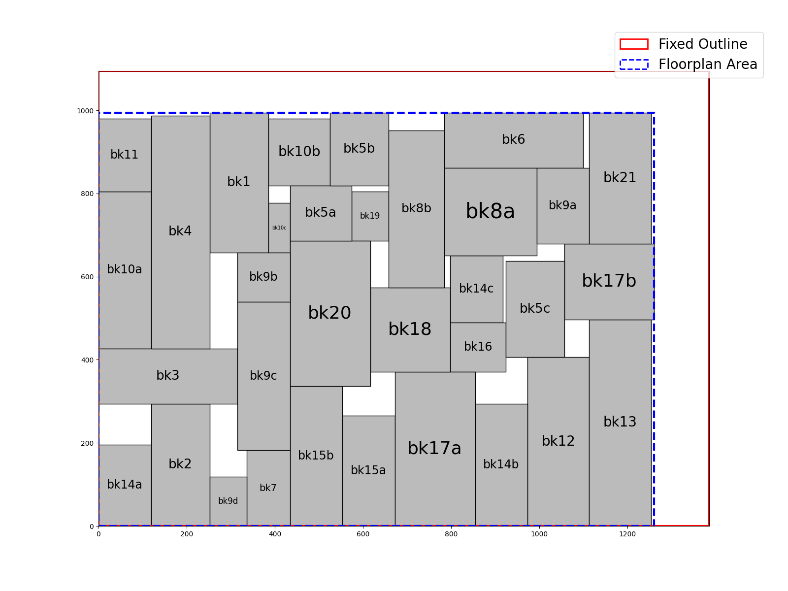
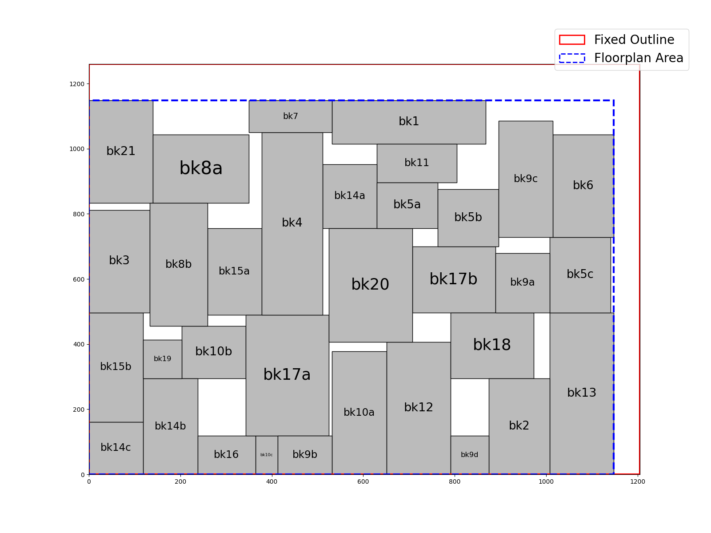
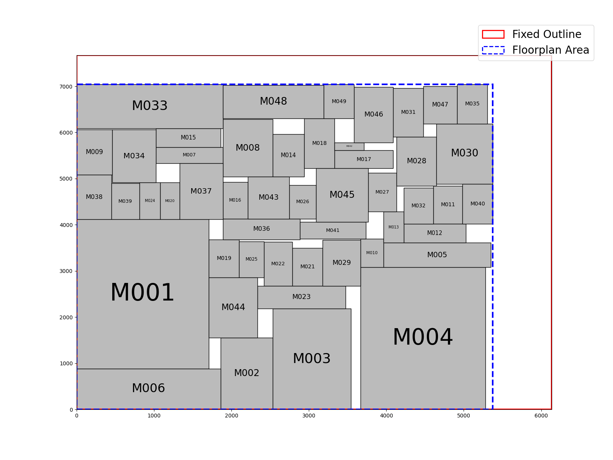
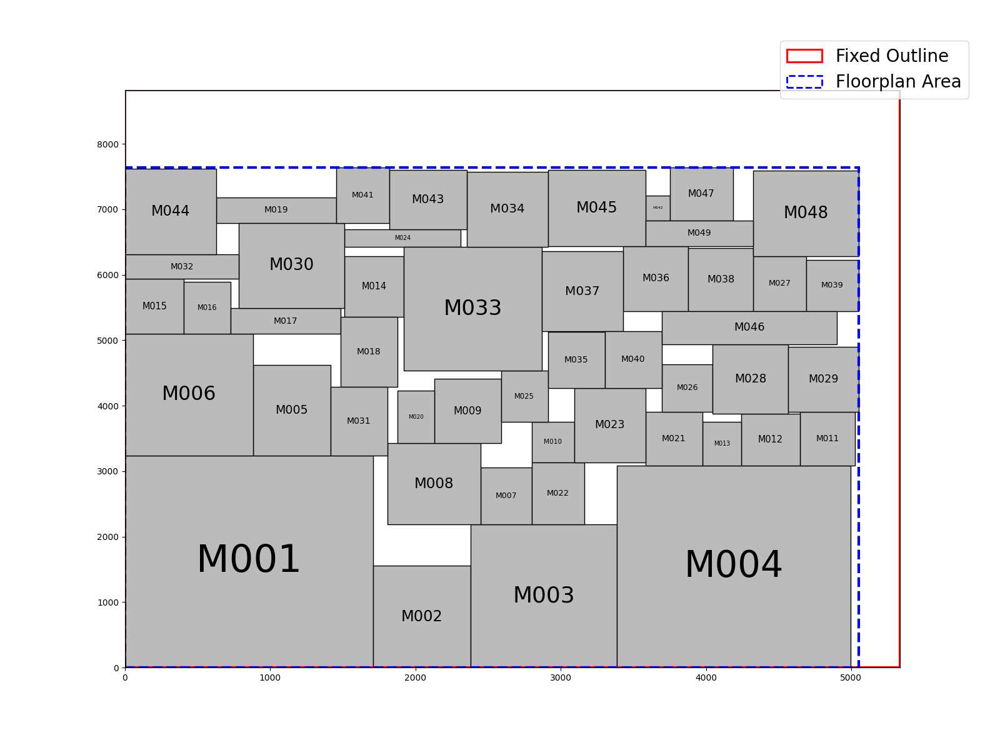
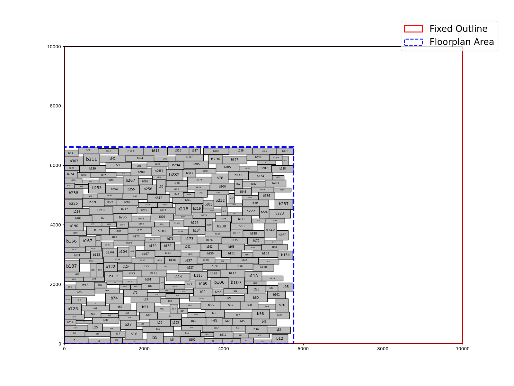

# Lab2 Fixed Outline Floorplanning
This lab focuses on designing a fixed-outline floorplanner to minimize the chip floorplan area. The goal is to place all macros within a rectangular chip region without exceeding the given outline, while minimizing the overall area and dead space. To achieve this, a B*-tree data structure is implemented in conjunction with a Simulated Annealing (SA) optimization algorithm to explore placement solutions. The final floorplan must satisfy the fixed-outline constraint and ensure that no overlaps occur among the macros.
  
For more details, refer to: [Lab2.pdf](Lab2.pdf)

## Compilation
Run the following command to compile the project:
```sh
make
```

## Clean
The following command removes all files generated during the compilation process:
```sh
make clean
```

## How to excecute
Run the program: 
```sh
./Lab2 [α value] [input.block] [input.net] [output]
```

## Drawing
```sh
python3 draw_floorplan_layout.py [input.block] [output] [PICTURE_NAME]
```

## Checker
```sh
./verifier [α value] [input.block] [input.net] [output]
```
## Results
| ami33a                      |
|:---------------------------:|
| |

| ami33b                      |
|:---------------------------:|
| |

| ami49a                      |
|:---------------------------:|
| |

| ami49b                      |
|:---------------------------:|
| |

| vda317b                      |
|:----------------------------:|
| |
